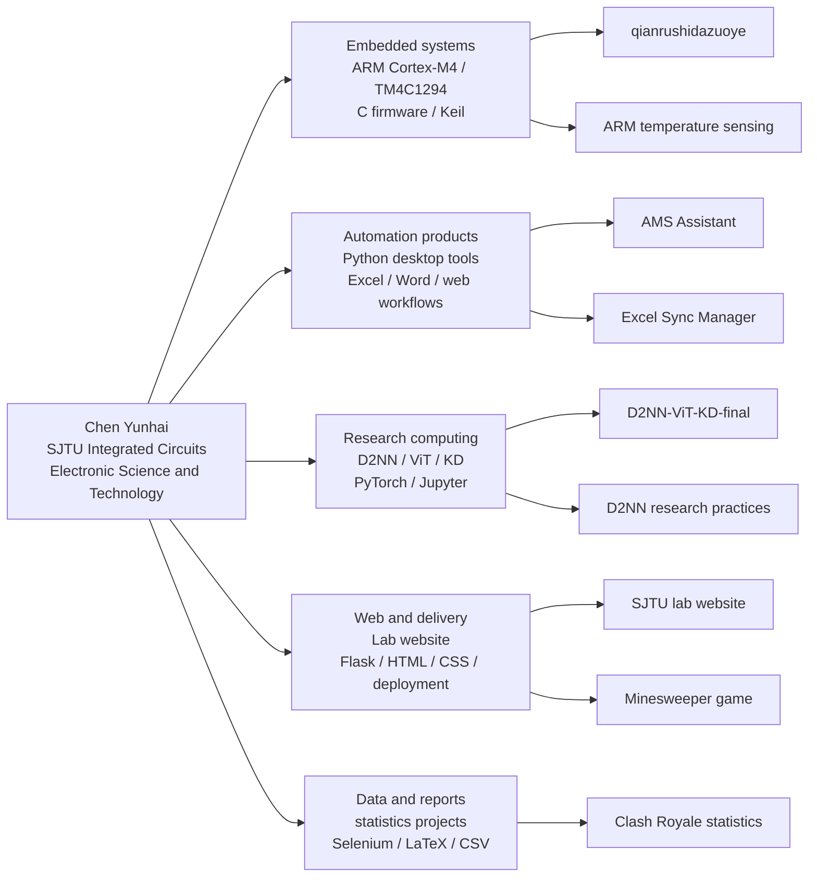
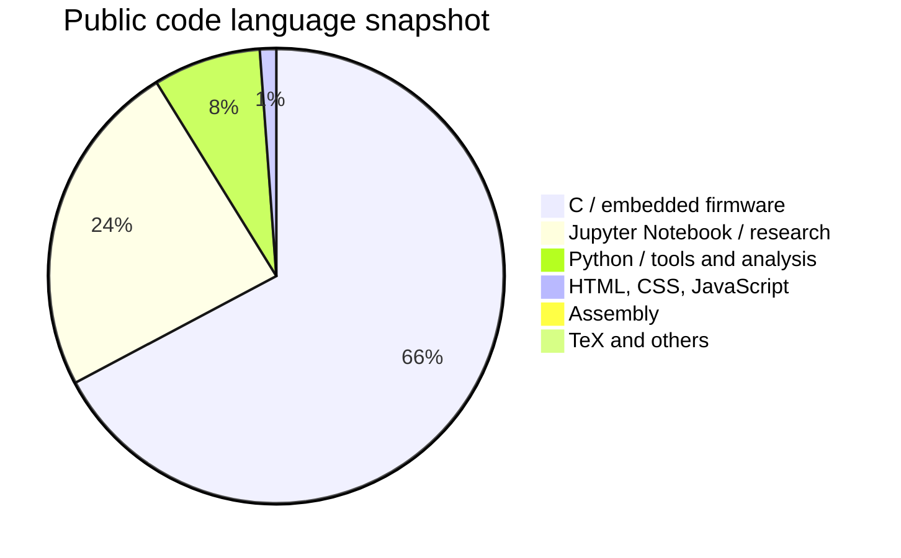

# Chen Yunhai / Cyh29hao

  <strong>Public project map and technical stack index</strong> 
  Shanghai Jiao Tong University, School of Integrated Circuits 
  Electronic Science and Technology, undergraduate

  <a href="#中文">中文</a>
  ·
  <a href="#english">English</a>
  ·
  <a href="https://github.com/Cyh29hao">GitHub Profile</a>

  
  
  
  
  

> Snapshot: 2026-06-24, UTC+8. This README is based on public GitHub repositories plus a small amount of resume context from local profile materials. Private contact details and non-public files are intentionally not included.

## Portfolio Map

## Quick Facts

| Area | Public evidence | Representative repositories |
| --- | --- | --- |
| Embedded systems | ARM Cortex-M4/TM4C1294 firmware, Keil projects, sensors, LCD/TM1638 UI, UART/encoding/frequency-control logic | [`qianrushidazuoye`](https://github.com/Cyh29hao/qianrushidazuoye), [`ARM-based-temperature-sensing-and-transmission-project`](https://github.com/Cyh29hao/ARM-based-temperature-sensing-and-transmission-project) |
| Python automation | Local-first tools for Excel/Word workflows, maritime-service automation, mail/event extraction, packaging and Windows launch scripts | [`AMS-Assistant-for-Maritime-Service`](https://github.com/Cyh29hao/AMS-Assistant-for-Maritime-Service), [`Automatic-Sync-Assistant-for-Excel-Files`](https://github.com/Cyh29hao/Automatic-Sync-Assistant-for-Excel-Files) |
| AI and research computing | D2NN experiments, ViT comparison, knowledge distillation, CIFAR-10/MNIST notebooks, smoke tests and reproducibility notes | [`D2NN-ViT-KD-final`](https://github.com/Cyh29hao/D2NN-ViT-KD-final), [`My-own-D2NN-Research-Practices`](https://github.com/Cyh29hao/My-own-D2NN-Research-Practices) |
| Web and documentation | Lab website, static game, README/release docs, public/private boundary documents | [`The-SJTU-Intelligent-Optoelectronic-Computing-Lab`](https://github.com/Cyh29hao/The-SJTU-Intelligent-Optoelectronic-Computing-Lab), [`Static-Online-Minesweeper-Game`](https://github.com/Cyh29hao/Static-Online-Minesweeper-Game) |
| Data analysis | Selenium collection, statistical analysis, CSV/XLSX datasets, LaTeX reports | [`clash-royale-card-balance-statistics`](https://github.com/Cyh29hao/clash-royale-card-balance-statistics) |

<strong>中文</strong>

## 简介

我是陈云海，上海交通大学集成电路学院电子科学与技术专业本科生，预计 2028 年毕业。现在的公开项目主要围绕四件事展开：嵌入式系统、AI 光计算与 D2NN 实验、Python 自动化工具，以及能上线维护的网站/文档工程。

我的兴趣不太像单一岗位标签，更接近“软硬结合 + 算法实践 + 工程落地”。简历材料里对自己的定位是：不做纯硬件，也不把自己说成纯前端；更关注能把算法、脚本、网页、自动化流程和实际需求连起来的项目。

## 现在 GitHub 上主要做了什么

### 1. 嵌入式与 ARM 综合实验

- [`qianrushidazuoye`](https://github.com/Cyh29hao/qianrushidazuoye) 是 ARM 大作业智能联网时钟系统，包含 S800/TM4C1294 板端 C 程序和 Python/PyQt5 PC 上位机。
- [`ARM-based-temperature-sensing-and-transmission-project`](https://github.com/Cyh29hao/ARM-based-temperature-sensing-and-transmission-project) 是《工程实践与科技创新 II》综合实验归档，基于 ARM Cortex-M4/TM4C1294 平台，保留双板 Keil 工程、共享编码/频率控制模块和最终报告。
- 公开代码中能看到的具体内容包括：LM75BD 温度采集、ADC/电压数据、LCD/TM1638 显示、按键交互、双板数据编码发送/解析、频率测量、红外输入、PWM 蜂鸣器/音乐联动、UART/事件协议等。

### 2. Python 自动化与本地工具

- [`AMS-Assistant-for-Maritime-Service`](https://github.com/Cyh29hao/AMS-Assistant-for-Maritime-Service) 把航运服务里的合同生成、通关查询回填、船期/港区入口、表格同步和私密业务包放进一个本地桌面工作台。
- [`Mail-Sorting-Assistant-for-Maritime-Service`](https://github.com/Cyh29hao/Mail-Sorting-Assistant-for-Maritime-Service) 是航运邮件小助理 MVP：FastAPI、SQLite、IMAP 增量同步、规则抽取、查询 API 和网页聊天界面。
- [`Automatic-Sync-Assistant-for-Excel-Files`](https://github.com/Cyh29hao/Automatic-Sync-Assistant-for-Excel-Files) 是 Excel Sync Manager V1，面向源表监听、列同步、锁文件重试和打包交付。

### 3. AI 光计算、D2NN 与研究复现

- [`D2NN-ViT-KD-final`](https://github.com/Cyh29hao/D2NN-ViT-KD-final) 是 Ver11r 易复现包，包含 notebook、requirements、CIFAR-10/MNIST 数据位置、ViT-B/16 权重 cache、烟测脚本、3090/JupyterLab 运行指南和报告。
- [`My-own-D2NN-Research-Practices`](https://github.com/Cyh29hao/My-own-D2NN-Research-Practices) 是个人 D2NN 研究练习空间，包含 D2NN、ViT、KD、CIFAR-10 等 notebook 与设计笔记。
- [`D2NN-Forked-`](https://github.com/Cyh29hao/D2NN-Forked-) 是 fork/practice 仓库，记录 D2NN、Beam Diffraction、MNIST/CIFAR-10、ViT vs D2NN 对比等探索。

### 4. 网站、文档和数据分析

- [`The-SJTU-Intelligent-Optoelectronic-Computing-Lab`](https://github.com/Cyh29hao/The-SJTU-Intelligent-Optoelectronic-Computing-Lab) 是上海交大光电智能计算实验室网站仓库，README 中列出主站和备份部署地址。
- [`clash-royale-card-balance-statistics`](https://github.com/Cyh29hao/clash-royale-card-balance-statistics) 是概率论与数理统计课程项目，基于 RoyaleAPI matchup 数据分析《皇室战争》卡牌平均强度与波动性关系；README 中记录了 168 张卡牌、39,429,252 场加权 matchup 样本和加权 Pearson 相关系数 `0.1476`。
- [`Aesthetics-Course-Essay-Preparation`](https://github.com/Cyh29hao/Aesthetics-Course-Essay-Preparation) 是基于课堂字幕整理的美学课程论文素材索引和写作手册。

### 5. 工具、游戏和算法旧档

- [`shuixian-skill`](https://github.com/Cyh29hao/shuixian-skill) 是一个 Codex skill 项目，用语言样本、聊天记录和关系偏好生成自我镜像 companion。
- [`Static-Online-Minesweeper-Game`](https://github.com/Cyh29hao/Static-Online-Minesweeper-Game) 是一个静态在线扫雷游戏，包含 GitHub Pages 页面、`index.html`、`app.js`、校验页面和 Supabase schema。
- [`Interesting-algorithms-in-my-OI-journey`](https://github.com/Cyh29hao/Interesting-algorithms-in-my-OI-journey) 记录了高中/早期 OI 训练中的 C++ 算法实现，例如网络流、树链剖分、莫队等。
- [`claude-code`](https://github.com/Cyh29hao/claude-code) 是一个 fork 的教育性 Python porting workspace，README 中说明其目标是 Python-first 的学习与移植练习。

## 技术栈快照

| 层面 | 已公开证据 |
| --- | --- |
| 嵌入式 | C, ARM Cortex-M4, TM4C1294NCPDT, Keil uVision5/MDK-ARM, ARMCC 5.x, DriverLib, CMSIS/RTE, LCD/TM1638, LM75BD, ADC, PWM, UART, IR, frequency measurement |
| Python 工具 | Python, PyQt5, FastAPI, SQLite, IMAP, Selenium, pandas, NumPy, matplotlib, pyserial, file watching, PyInstaller/release scripts |
| AI/研究 | PyTorch, torchvision, Jupyter Notebook, D2NN, ViT-B/16, knowledge distillation, CIFAR-10, MNIST, smoke tests and reproducibility docs |
| Web | Flask, HTML, CSS, JavaScript, GitHub Pages, Render-style deployment, reverse proxy/SSL deployment experience from lab website materials |
| 数据与文档 | CSV/XLSX, LaTeX/TeX, PDF reports, Markdown docs, README/release/public-boundary documentation |
| 算法基础 | C/C++, data structures, graph algorithms, dynamic programming, OI practice archive |

## 语言占比说明

这个占比不是能力评分，只是公开仓库的代码体量组成。刚完成提交的 ARM 温度传感器仓库会显著增加 C/头文件体量，尤其是 TM4C driverlib 和 inc 支持文件。

| Language | Approx. share | 主要来源 |
| --- | ---: | --- |
| C | 66.37% | ARM 智能时钟、ARM 温度采集/传输双板工程、TM4C 支持文件 |
| Jupyter Notebook | 23.65% | D2NN / ViT / KD 研究 notebook |
| Python | 7.55% | 自动化工具、上位机、数据分析、ML 脚本、Codex skill |
| HTML/CSS/JavaScript | 1.15% | 实验室网站、静态扫雷、网页 UI |
| Assembly | 0.64% | ARM startup/support files |
| TeX and others | 0.64% | 课程报告、构建脚本、算法旧档等 |

## 公开仓库索引

| Repository | 内容 | 技术关键词 | 状态 |
| --- | --- | --- | --- |
| [`qianrushidazuoye`](https://github.com/Cyh29hao/qianrushidazuoye) | ARM 智能联网时钟系统；S800/TM4C1294 板端 C 程序 + PyQt5 PC 上位机。 | C, ARM, TM4C1294, Keil, UART, SysTick, PyQt5, pyserial | 课程大作业归档/提交准备版本。 |
| [`ARM-based-temperature-sensing-and-transmission-project`](https://github.com/Cyh29hao/ARM-based-temperature-sensing-and-transmission-project) | ARM 温度采集与传输综合实验；双板 Keil 工程、共享编码模块、最终报告。 | C, ARM Cortex-M4, TM4C1294, LM75BD, ADC, LCD, TM1638, PWM, IR, Keil | 已提交公开归档。 |
| [`AMS-Assistant-for-Maritime-Service`](https://github.com/Cyh29hao/AMS-Assistant-for-Maritime-Service) | 航运业务本地桌面自动化工作台。 | Python, desktop app, Excel/Word automation, browser automation, packaging | 可展示的业务自动化原型。 |
| [`Mail-Sorting-Assistant-for-Maritime-Service`](https://github.com/Cyh29hao/Mail-Sorting-Assistant-for-Maritime-Service) | 航运邮件同步、抽取和查询 MVP。 | Python, FastAPI, SQLite, IMAP, web UI | 可运行 MVP。 |
| [`Automatic-Sync-Assistant-for-Excel-Files`](https://github.com/Cyh29hao/Automatic-Sync-Assistant-for-Excel-Files) | Excel 文件同步管理器。 | Python, GUI, Excel automation, PyInstaller | 小型本地工具。 |
| [`The-SJTU-Intelligent-Optoelectronic-Computing-Lab`](https://github.com/Cyh29hao/The-SJTU-Intelligent-Optoelectronic-Computing-Lab) | 实验室网站仓库。 | Python, HTML, CSS, deployment | 公开网站仓库。 |
| [`D2NN-ViT-KD-final`](https://github.com/Cyh29hao/D2NN-ViT-KD-final) | D2NN/ViT/KD 易复现包。 | Jupyter, Python, PyTorch, ViT, D2NN, CIFAR-10 | 复现包。 |
| [`My-own-D2NN-Research-Practices`](https://github.com/Cyh29hao/My-own-D2NN-Research-Practices) | 个人 D2NN 研究练习 notebooks。 | Jupyter, D2NN, ViT, KD | 研究练习空间。 |
| [`D2NN-Forked-`](https://github.com/Cyh29hao/D2NN-Forked-) | D2NN fork/practice 仓库。 | Jupyter, PyTorch, D2NN, beam diffraction | Fork/practice。 |
| [`clash-royale-card-balance-statistics`](https://github.com/Cyh29hao/clash-royale-card-balance-statistics) | RoyaleAPI 数据统计课程项目。 | Python, Selenium, statistics, LaTeX | 可复现实验报告。 |
| [`Aesthetics-Course-Essay-Preparation`](https://github.com/Cyh29hao/Aesthetics-Course-Essay-Preparation) | 美学课程论文素材索引。 | Markdown, PDF, course notes | 文档整理。 |
| [`shuixian-skill`](https://github.com/Cyh29hao/shuixian-skill) | Codex self-mirror companion skill。 | Python, Codex Skill, transcript import | 工具/skill 项目。 |
| [`claude-code`](https://github.com/Cyh29hao/claude-code) | 教育性 Python porting workspace。 | Python, tests, CLI metadata | Fork；教育用途。 |
| [`Static-Online-Minesweeper-Game`](https://github.com/Cyh29hao/Static-Online-Minesweeper-Game) | 静态在线扫雷游戏。 | HTML, JavaScript, Python, GitHub Pages | 静态游戏。 |
| [`Interesting-algorithms-in-my-OI-journey`](https://github.com/Cyh29hao/Interesting-algorithms-in-my-OI-journey) | OI 时代 C++ 算法旧档。 | C++, graph algorithms, data structures | 小型算法 archive。 |
| [`my-Tech-Stack-202606`](https://github.com/Cyh29hao/my-Tech-Stack-202606) | 本仓库；公开项目与技术栈索引。 | Markdown, portfolio index | 当前索引。 |

## 边界

- 这里写的是公开仓库能支撑的事实，不是完整简历。
- 课程项目、研究练习、fork 和业务原型在索引中分别标注。
- GitHub language statistics 会受 driverlib、notebook、生成文件和报告材料影响，不应直接理解为个人能力比例。

<strong>English</strong>

## Profile

I am Chen Yunhai, an undergraduate student in Electronic Science and Technology at the School of Integrated Circuits, Shanghai Jiao Tong University. My expected graduation year is 2028.

My public repositories are mostly about embedded systems, AI/optoelectronic computing experiments, Python automation tools, and web/documentation work that can be delivered and maintained. The common thread is practical engineering: connect firmware, algorithms, scripts, web interfaces, and real workflows into usable projects.

## What Is On This GitHub

### 1. Embedded Systems and ARM Coursework

- [`qianrushidazuoye`](https://github.com/Cyh29hao/qianrushidazuoye) is an ARM intelligent networked clock system with S800/TM4C1294 firmware and a Python/PyQt5 PC host.
- [`ARM-based-temperature-sensing-and-transmission-project`](https://github.com/Cyh29hao/ARM-based-temperature-sensing-and-transmission-project) is the final archive for an ARM temperature sensing and transmission course project. It contains dual-board Keil projects, shared codec/frequency-control modules, and the final report.
- Public code covers LM75BD temperature sensing, ADC/voltage data, LCD/TM1638 display, key input, two-board data encoding/transmission/parsing, frequency measurement, infrared input, PWM buzzer/music output, UART, and event-style communication.

### 2. Python Automation and Local Tools

- [`AMS-Assistant-for-Maritime-Service`](https://github.com/Cyh29hao/AMS-Assistant-for-Maritime-Service) is a local desktop workbench for maritime-service workflows, including contract generation, customs-clearance query and backfill, spreadsheet sync, and private business packs.
- [`Mail-Sorting-Assistant-for-Maritime-Service`](https://github.com/Cyh29hao/Mail-Sorting-Assistant-for-Maritime-Service) is an MVP with FastAPI, SQLite, IMAP incremental sync, rule-based extraction, query APIs, and a small web UI.
- [`Automatic-Sync-Assistant-for-Excel-Files`](https://github.com/Cyh29hao/Automatic-Sync-Assistant-for-Excel-Files) is an Excel Sync Manager for watched files, selected-column sync, lock retry, and packaged delivery.

### 3. AI, D2NN, and Research Computing

- [`D2NN-ViT-KD-final`](https://github.com/Cyh29hao/D2NN-ViT-KD-final) is a reproducible Ver11r package with notebooks, requirements, data paths, ViT-B/16 weight cache, smoke tests, a GPU/JupyterLab guide, and reports.
- [`My-own-D2NN-Research-Practices`](https://github.com/Cyh29hao/My-own-D2NN-Research-Practices) collects personal D2NN practice notebooks and notes around D2NN, ViT, knowledge distillation, CIFAR-10, and MNIST.
- [`D2NN-Forked-`](https://github.com/Cyh29hao/D2NN-Forked-) is a fork/practice repository for D2NN, beam diffraction, MNIST/CIFAR-10, and ViT-vs-D2NN comparison work.

### 4. Web, Documents, and Data Analysis

- [`The-SJTU-Intelligent-Optoelectronic-Computing-Lab`](https://github.com/Cyh29hao/The-SJTU-Intelligent-Optoelectronic-Computing-Lab) is the repository for the SJTU Intelligent Optoelectronic Computing Lab website.
- [`clash-royale-card-balance-statistics`](https://github.com/Cyh29hao/clash-royale-card-balance-statistics) is a probability/statistics course project based on RoyaleAPI matchup data. The README reports 168 cards, 39,429,252 weighted matchup samples, and a weighted Pearson correlation of `0.1476`.
- [`Aesthetics-Course-Essay-Preparation`](https://github.com/Cyh29hao/Aesthetics-Course-Essay-Preparation) is a lecture-subtitle-based writing and topic index for an aesthetics course essay.

### 5. Tools, Game, and Algorithm Notes

- [`shuixian-skill`](https://github.com/Cyh29hao/shuixian-skill) is a Codex skill project for building a self-mirror companion from language samples, chat records, and relationship preferences.
- [`Static-Online-Minesweeper-Game`](https://github.com/Cyh29hao/Static-Online-Minesweeper-Game) is a static online Minesweeper game with a GitHub Pages entry.
- [`Interesting-algorithms-in-my-OI-journey`](https://github.com/Cyh29hao/Interesting-algorithms-in-my-OI-journey) is an older C++ algorithm archive from OI practice.
- [`claude-code`](https://github.com/Cyh29hao/claude-code) is a forked educational Python porting workspace.

## Stack Snapshot

| Layer | Public evidence |
| --- | --- |
| Embedded | C, ARM Cortex-M4, TM4C1294NCPDT, Keil uVision5/MDK-ARM, ARMCC 5.x, DriverLib, CMSIS/RTE, LCD/TM1638, LM75BD, ADC, PWM, UART, IR, frequency measurement |
| Python tools | Python, PyQt5, FastAPI, SQLite, IMAP, Selenium, pandas, NumPy, matplotlib, pyserial, file watching, PyInstaller/release scripts |
| AI/research | PyTorch, torchvision, Jupyter Notebook, D2NN, ViT-B/16, knowledge distillation, CIFAR-10, MNIST, smoke tests and reproducibility docs |
| Web | Flask, HTML, CSS, JavaScript, GitHub Pages, Render-style deployment, reverse proxy/SSL deployment experience from lab website materials |
| Data/docs | CSV/XLSX, LaTeX/TeX, PDF reports, Markdown docs, README/release/public-boundary documentation |
| Algorithms | C/C++, data structures, graph algorithms, dynamic programming, OI practice archive |

## Language Footprint

These are repository composition numbers, not a skill score. The newly committed ARM temperature project increases the C share significantly because it includes TM4C driver headers and support files.

| Language | Approx. share | Main source |
| --- | ---: | --- |
| C | 66.37% | ARM clock project, ARM temperature sensing/transmission project, TM4C support files |
| Jupyter Notebook | 23.65% | D2NN / ViT / KD research notebooks |
| Python | 7.55% | automation tools, PC host, data analysis, ML scripts, Codex skill |
| HTML/CSS/JavaScript | 1.15% | lab website, static Minesweeper, small web UIs |
| Assembly | 0.64% | ARM startup/support files |
| TeX and others | 0.64% | course reports, build scripts, algorithm archive |

## Repository Index

| Repository | Contents | Keywords | Status |
| --- | --- | --- | --- |
| [`qianrushidazuoye`](https://github.com/Cyh29hao/qianrushidazuoye) | ARM intelligent networked clock system: S800/TM4C1294 firmware plus a PyQt5 PC host. | C, ARM, TM4C1294, Keil, UART, SysTick, PyQt5, pyserial | Coursework archive / submission-ready version. |
| [`ARM-based-temperature-sensing-and-transmission-project`](https://github.com/Cyh29hao/ARM-based-temperature-sensing-and-transmission-project) | ARM temperature sensing and transmission experiment: dual-board Keil projects, shared codec modules, final report. | C, ARM Cortex-M4, TM4C1294, LM75BD, ADC, LCD, TM1638, PWM, IR, Keil | Public final archive. |
| [`AMS-Assistant-for-Maritime-Service`](https://github.com/Cyh29hao/AMS-Assistant-for-Maritime-Service) | Local desktop automation workbench for maritime-service workflows. | Python, desktop app, Excel/Word automation, browser automation, packaging | Business automation prototype. |
| [`Mail-Sorting-Assistant-for-Maritime-Service`](https://github.com/Cyh29hao/Mail-Sorting-Assistant-for-Maritime-Service) | Mail sync, extraction, and query MVP for maritime-service messages. | Python, FastAPI, SQLite, IMAP, web UI | Runnable MVP. |
| [`Automatic-Sync-Assistant-for-Excel-Files`](https://github.com/Cyh29hao/Automatic-Sync-Assistant-for-Excel-Files) | Excel file synchronization manager. | Python, GUI, Excel automation, PyInstaller | Small local utility. |
| [`The-SJTU-Intelligent-Optoelectronic-Computing-Lab`](https://github.com/Cyh29hao/The-SJTU-Intelligent-Optoelectronic-Computing-Lab) | Lab website repository. | Python, HTML, CSS, deployment | Public website repository. |
| [`D2NN-ViT-KD-final`](https://github.com/Cyh29hao/D2NN-ViT-KD-final) | Reproducible D2NN/ViT/KD package. | Jupyter, Python, PyTorch, ViT, D2NN, CIFAR-10 | Reproducibility package. |
| [`My-own-D2NN-Research-Practices`](https://github.com/Cyh29hao/My-own-D2NN-Research-Practices) | Personal D2NN research-practice notebooks. | Jupyter, D2NN, ViT, KD | Research-practice workspace. |
| [`D2NN-Forked-`](https://github.com/Cyh29hao/D2NN-Forked-) | Fork/practice D2NN repository. | Jupyter, PyTorch, D2NN, beam diffraction | Fork/practice. |
| [`clash-royale-card-balance-statistics`](https://github.com/Cyh29hao/clash-royale-card-balance-statistics) | RoyaleAPI-based statistics course project. | Python, Selenium, statistics, LaTeX | Reproducible report. |
| [`Aesthetics-Course-Essay-Preparation`](https://github.com/Cyh29hao/Aesthetics-Course-Essay-Preparation) | Aesthetics course essay material index. | Markdown, PDF, course notes | Documentation project. |
| [`shuixian-skill`](https://github.com/Cyh29hao/shuixian-skill) | Codex self-mirror companion skill. | Python, Codex Skill, transcript import | Tool/skill project. |
| [`claude-code`](https://github.com/Cyh29hao/claude-code) | Educational Python porting workspace. | Python, tests, CLI metadata | Fork; educational use. |
| [`Static-Online-Minesweeper-Game`](https://github.com/Cyh29hao/Static-Online-Minesweeper-Game) | Static online Minesweeper game. | HTML, JavaScript, Python, GitHub Pages | Static game. |
| [`Interesting-algorithms-in-my-OI-journey`](https://github.com/Cyh29hao/Interesting-algorithms-in-my-OI-journey) | Older C++ OI algorithm archive. | C++, graph algorithms, data structures | Small algorithm archive. |
| [`my-Tech-Stack-202606`](https://github.com/Cyh29hao/my-Tech-Stack-202606) | This repository: public project and tech-stack index. | Markdown, portfolio index | Current index. |

## Boundaries

- This README is a factual public index, not a full resume.
- Coursework, research practice, forks, and business prototypes are marked as such.
- GitHub language statistics are affected by driver libraries, notebooks, generated files, and reports. They should be read as repository composition, not personal proficiency percentages.

